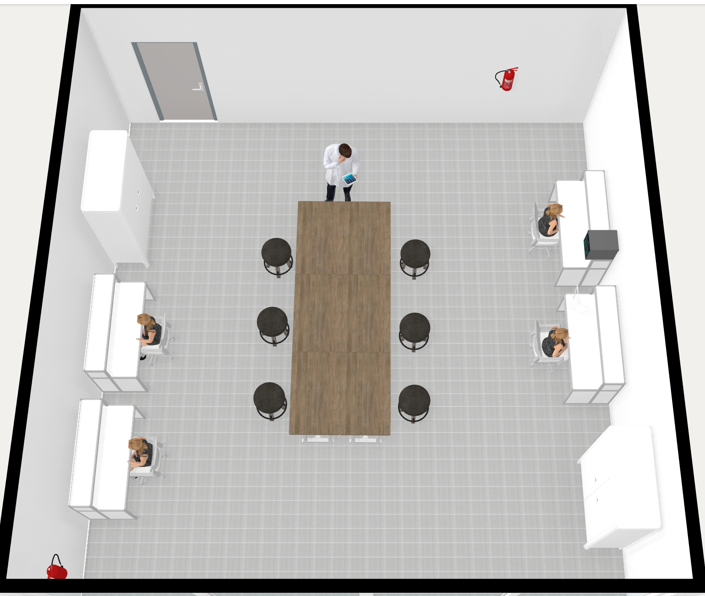

# Espacio Maker "El Templo"

## En construcción ... 

## Plano y distribución

## Recreación 3D

## Gif Animado

## **Instalación Eléctrica**
### 1. **Infraestructura Básica**
- Posible sugerencia a los electricistas:
- **Cableado subterráneo** (bajo suelo técnico):
  - 2 líneas independientes (1 para mesas de laboratorio, 1 para resto)

- **Protecciones**:
  - 2 magnetotérmicos (20A) + diferencial (30mA) con su Normativa UNE-EN ISO 7010 

## **🗄️ Distribución de Mobiliario**

| Cantidad | Tipo Mobiliario | Ref. | Enlace         |
|---|--------------------|----------|------------------------------------|
| 4 | Mesas laboratorio  | MOB-10000-15x7 | [Ver](http://www.electrostatex.com/Productos-Antiestaticos/mesa-trabajo-antiestatica.php) |
| 4 | Sillas             |    X     | Pendientes de buscar |
| X | Mesas Centrales    |    X     | Pendientes de buscar |
| 6 | Taburetes altos    |    X     | Pendientes de buscar |
| 2 | Armario 2 puertas  | 177-0281 | [Ver](https://es.rs-online.com/web/p/armarios-de-almacenaje/1770281?gb=s) |
| 2 |ExtintorPolvo ABC 6kg |    X    |  * En el caso de que no hubiera Splits Contraincendios  |
| 2 | Señal Extintor     | 220-9879 | [Ver](https://es.rs-online.com/web/p/senales-de-proteccion-contra-incendios/2209879?gb=s) |

## **Equipamiento Principal**
### 🔧 Herramientas Manuales (Armario)
**Herramientas Generales:**

| Herramienta                            | Código RS Online | Enlace |
|----------------------------------------|------------------|--------|
| Juegos de destornilladores (6 uds)     | 253-015          | [Ver](https://es.rs-online.com/web/p/juegos-de-destornilladores/0253015?gb=s) |
| Llaves Allen métricas (9 piezas)       | 762-1534         | [Ver](https://es.rs-online.com/web/p/llaves-hexagonales/7621534?gb=s) |
| Llaves Torx (7 piezas)                 | 669-8202         | [Ver](https://es.rs-online.com/web/p/llaves-torx/6698202?gb=s) |
| Limas grandes para Metal               | 221-6228         | [Ver](https://es.rs-online.com/web/p/limas/2216228?gb=s) |
| Llave inglesa                          | 469-7018         | [Ver](https://es.rs-online.com/web/p/llaves-ajustables/4697018?gb=s) |
| Llavesde vaso                          | 287-6557         | [Ver](https://es.rs-online.com/web/p/llaves-de-carraca/2876557) |
| Arco de sierra                         | 285-5085         | [Ver](https://es.rs-online.com/web/p/sierras-manuales/2855085?gb=s) |
| Hojas de sierra                        | 174-6799         | [Ver](https://es.rs-online.com/web/p/hojas-de-sierras-de-mano/1746799?gb=s) |
| Alicates (juego 3 piezas)              | 276-5875         | [Ver](https://es.rs-online.com/web/p/alicates/2765875?gb=s) |
| Alicates de pico de loro               | 281-9182         | [Ver](https://es.rs-online.com/web/p/alicates/2819182?gb=s) |
| Martillo bola                          | 125-0943         | [Ver](https://es.rs-online.com/web/p/martillos/1250943?gb=s) |
| Tornillo/Mordaza de banco              | 512-112          | [Ver](https://es.rs-online.com/web/p/tornillos-de-banco/0512112?gb=a) |

---

## 🔌 Herramientas Electrónica (Cajoneras con llave)

| Herramienta                            | Código RS Online | Enlace |
|----------------------------------------|------------------|--------|
| Pinzas electrónica (4 uds)             | 545-187          | [Ver](https://es.rs-online.com/web/p/pinzas/0545187?gb=s) |
| Alicates de corte fino (4 uds)         | 864-0772         | [Ver](https://es.rs-online.com/web/p/alicates-de-corte/8640772?gb=a) |
| Chupón desoldador (2 uds)              | 124-226          | [Ver](https://es.rs-online.com/web/p/desoldadores/124226/) |
| Malla desoldante   (2 uds)             | 148-5553         | [Ver](https://es.rs-online.com/web/p/mallas-desoldadoras/1485553?gb=s) |
| Estaño para soldar (2 uds)             | 244-1547         | [Ver](https://es.rs-online.com/web/p/estano-e-hilo-de-soldar/2441547?gb=s) |
| Destornilladores precisión (6 uds)     | 864-0861         | [Ver](https://es.rs-online.com/web/p/juegos-de-destornilladores/8640861?gb=s) |
| Multímetro digital (2 uds)             | 283-6153         | [Ver](https://es.rs-online.com/web/p/multimetros/2836153?gb=s) |

## 🧪 Equipos Especializados

| Herramienta                            | Código RS Online | Enlace |
|----------------------------------------|------------------|--------|
| Estación soldadura    (1 ud)           | 173-7303         | [Ver](https://es.rs-online.com/web/p/estaciones-de-soldadura/1737303?gb=s) |
| Puntas soldador        (5 uds)         | 175-1196         | [ver](https://es.rs-online.com/web/p/puntas-de-soldadores-electricos/1751196) |
| Extractor de humos (con HEPA) (1 ud)   | 123-4905         | [Ver](https://es.rs-online.com/web/p/aspiradores-de-humo-de-soldadura/1234905?gb=s) |
| Filtro Carbono Activo (5 uds)          | 123-4906         | [Ver](https://es.rs-online.com/web/p/accesorios-para-aspiradores-de-humo-de-soldadura/1234906) |
| Pistola de aire caliente   (1 ud)      | 175-7106         | [Ver](https://es.rs-online.com/web/p/pistolas-de-aire-caliente/1757106?gb=s) |
| Flexo con lupa (4 uds)                 | 172-0138         | [Ver](https://es.rs-online.com/web/p/lamparas-de-aumento/1720138) |
| Tapetes ESD (6 uds)                    | 251-7686         | [Ver](https://es.rs-online.com/web/p/alfombras-antiestaticas/2517686?gb=s) |
| Cable a tierra de tapete (6 uds)       | 273-6717         | [Ver](https://es.rs-online.com/web/p/puesta-a-tierra-esd/2736717) |
| Conector a tierra de tapete (6 uds)    | 276-9532         | [Ver](https://es.rs-online.com/web/p/puesta-a-tierra-esd/2769532) |
| Valorar IMpresora 3D (1 uds)           | X                | X |

## **Material Consumible**
- Rollo estaño 60/40 (4 unidades)
- Hojas sierra repuesto (10 unidades)
- Y herramientas que por uso y desgaste lo requieran.

## **Material Electrónico y Maker para los proyectos**
  - Por determinar.

## **Observaciones Técnicas**
1. **Distribución herramientas**:
   - Herramientas grandes → Armario principal
   - Herramientas precisas → Cajoneras con llave
2. **Mantenimiento**:
   - Revisión instalación eléctrica ( sería añadida a la revision general del edificio)
   - Calibración anual equipos de medida (no es necesaría)
